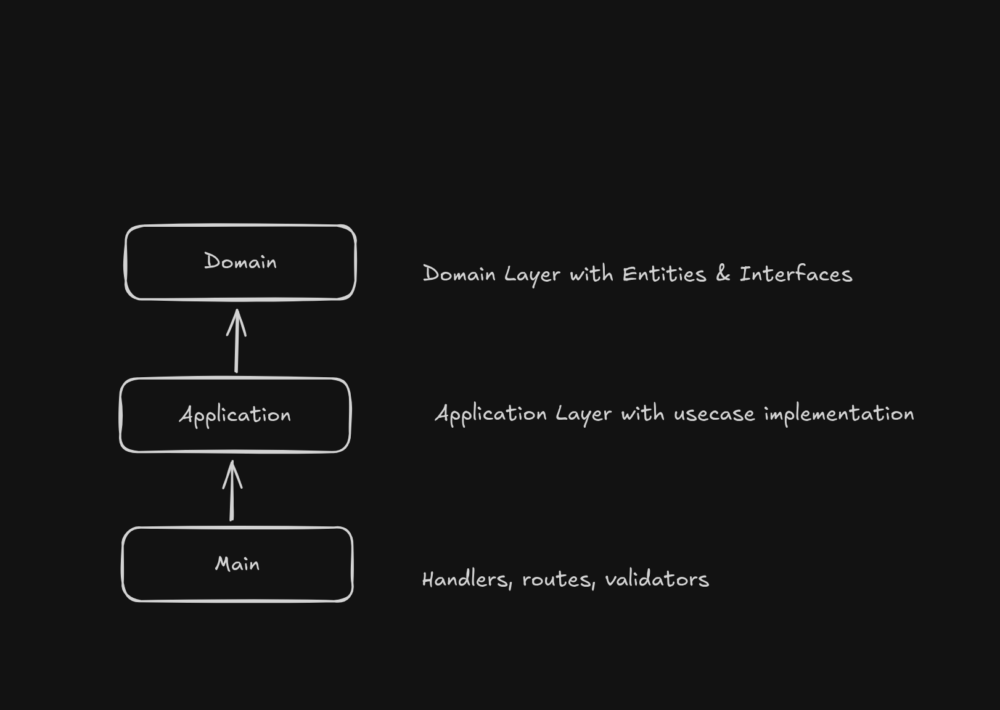

# Async Process Orders Challenge

## Resumo

Api responsável por criar e consultar pedidos via HTTPs e consumer responsável por ler os pedidos e processar via mensageria.

## Pré Requisitos

### Obrigatório

- [Docker](https://www.docker.com/)
- [Docker-Compose](https://docs.docker.com/compose/install/linux/)

### Opcional

- [Node (20)](https://nodejs.org/en/)

## Arquitetura do projeto

A arquitetura separa responsabilidades em três camadas: Main expõe handlers, rotas e validadores; Application implementa os casos de uso; Domain contém entidades e interfaces do domínio. Essa divisão reduz acoplamento, facilita testes e evoluções independentes entre interface, lógica de aplicação e modelo de negócio.



## Como executar localmente (DOCKERFILE + DOCKER COMPOSE)

Esse projeto depende de um broker kafka, para evitar erros de integração, rode a imagem com docker-compose.

```
docker compose up -d
```

No root do projeto, realize o build da imagem docker do nosso projeto.

```
sudo docker build -t async-process-orders .
```

Execute a imagem anteriormente construida

```
docker run --rm -p 3000:3000 --add-host=host.docker.internal:host-gateway async-process-orders
```

## Rotas (curls)

**POST /pedidos**

```bash
curl -d '{"clientDocument":"3261278361321","items":[{"name":"arroz"}]}' \
  -H 'Content-Type: application/json' \
  http://localhost:3000/pedidos

```

**GET /pedidos/:order_id**

```bash
curl 'http://localhost:3000/pedidos/3efa02a2-c5fe-4f5e-8fca-213a468f245c'
```

## Rodando localmente (SEM DOCKERFILE)

Instale todas dependencias

```bash
npm ci
```

Rode o docker compose

```bash
docker-compose up -d
```

Realize o build e execute o servidor http & consumer

```bash
npm run build && npm run dev
```

## Testes

Rodar testes unitários

```bash
npm run test
```

Rodar testes unitários+coverage

```bash
npm run test:coverage
```
